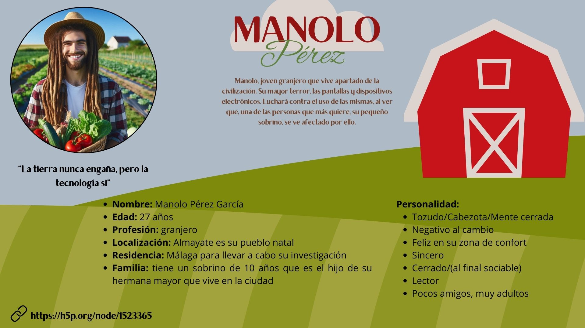

# Proyecto Storytelling Grupo 9: 
### my_storytelling
Creación de la historia interactiva de la asignatura [Creatividad e innovación Audiovisual](https://www.ugr.es/estudiantes/grados/grado-comunicacion-audiovisual/creacion-difusion-nuevos-contenidos-audiovis), repositorio de proyectos y documentación en https://github.com/mgea/storytelling

Autores:  
<!---
Incluir lista de personas del grupo 
Se puede añadir enlace a página personal de github o lo que se quiera...(optativo)
-->

- :man: Giovanni Ribeiro
- :woman: Esther Gimeno Garcia
- :woman: Mayte Luque
- :woman: Marta Gual

Proyecto - Grupo 9: https://github.com/giovannirpaiva/my_storytelling

Tipo/Género:  
- [ ] FictionCiberpunk  
- [x] Reality/tribus urbanas  
- [ ] Comic

## Resumen
Manolo es un joven granjero que ha vivido toda la vida en el campo, pero le surge un problema familiar que provoca su traslado a la ciudad. Su sobrino está muy enganchado a las pantallas y eso le lleva a replantearse múltiples aspectos sobre la relación entre la sociedad y la tecnología. Es entonces cuando decide empezar una investigación con la que conseguir soluciones para desconectar a las personas de las pantallas y volverlas a conectar con el mundo exterior. Manolo, que es muy místico, tiene la certeza de que tiene el don de leer mentes y ser un experto sobre comportamiento humano. Su método es incitar a la gente de la ciudad a explorar la belleza y el espacio de su granja, porque de ese modo todos aquellos que fueran sometidos a ese cambio, recuperarían de nuevo la ilusión por hacer cosas y renacería su creatividad, dejando atrás esa desgana y sumisión provocada por la adicción a los aparatos tecnológicos.

### Personajes

**Nombre:** Manolo Pérez García 

**Edad:** 27 años

**Profesión:** granjero

**Lugar de nacimiento:** Almayate

**Residencia:** Málaga centro

**Familia:** Hermana mayor y sobrino de 10 años

**Personalidad:**
- Tozudo, cabezón, de mente cerrada
- Negativo al cambio
- Feliz y acomodado en su zona de confort
- Sincero
- Poco sociable, se aprecia evolución positiva en la historia
- De pocos amigos
- Se relaciona con gente mucho más adulta

### Historia
Manolo Pérez García es un joven granjero que vive desde su nacimiento afincado 
en su granja, muy pocas veces ha ido a la ciudad ya que sentía que no era su lugar. Cuando su hermana se mudo a la ciudad Manolo iba con más frecuencia a visitarla, viendo así el problema que las personas tenían con las tecnologías y cómo el comportamiento humano había cambiado, ya que él se considera experto en ello, fue así como Manolo empezó con la idea de iniciar una investigación sobre la adicción de las personas a las nuevas tecnologías. Sin embargo, hasta que su sobrino no nació no empezó con las investigación.

### Contexto
Manolo es un chico de 27 años de padres malagueños, en concreto de Almayate, ambos granjeros al igual que él. Al mudarse su hermana a la ciudad hace que tenga más contacto con las tecnologías dándose cuenta de la adicción que tiene la gente a ellas. 

### Conflicto 
Manolo desde que fue a la ciudad quiso iniciar la investigación pero el agobio que le produce estar allí nunca la iniciaba. El nacimiento de su sobrino fue lo que hizo que comenzase con su investigación ya que no quería que su propio sobrino estuviera enganchado o por lo menos entender porque lo estaba y ayudarle a ver/disfrutar la vida de la manera en la que él y su madre (hermana de Manolo) lo habían hecho.

### Productos

- Image del [Personaje](img_Manolo.png)

- Interactivo: https://h5p.org/node/1523365

- Banner/Teaser:  (enlace) 

- Storytelling: (enlace) 

### Conclusiones/Valoración del equipo

------

<!---
Lista completa de emojis de markDown - https://gist.github.com/rxaviers/7360908) 
-->

Marzo, 2025

Proyecto dentro de la serie [Narrativas interactivas](https://github.com/mgea/storytelling/blob/master/What_is_a_digital_storytelling.md) 
Proyectos seleccionados de [2023](https://github.com/mgea/storytelling/tree/master/2023), [2022](https://github.com/mgea/storytelling/blob/master/2022/readme.md) / [2021](https://github.com/mgea/storytelling/blob/master/2021/readme.md) / [2020](https://github.com/mgea/storytelling/blob/master/2020/readme.md)  / 
[2019](https://github.com/mgea/storytelling/blob/master/2019/readme.md) / [2018](https://github.com/mgea/storytelling/blob/master/2018/readme.md) 

CC BYNCSA [Creatividad e Innovación Audiovisual-B](https://github.com/mgea/criav/)

 

[Facultad de Comunicación y Documentación](http://fcd.ugr.es)

Universidad de Granada
